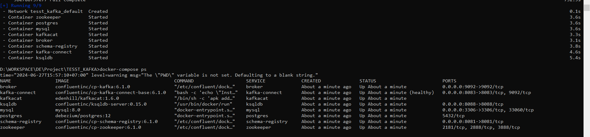
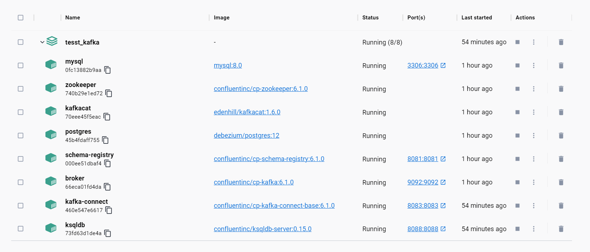

= Streaming data from Kafka to a Database using Kafka Connect JDBC Sink

This uses Docker Compose to run the Kafka Connect worker.

1. Bring the Docker Compose up
+
[source,bash]
----
docker-compose up -d
----

2. Make sure everything is up and running
+
[source,bash]
----
➜ docker-compose ps
     Name                    Command                  State                     Ports
---------------------------------------------------------------------------------------------------
broker            /etc/confluent/docker/run        Up             0.0.0.0:9092->9092/tcp
kafka-connect     bash -c cd /usr/share/conf ...   Up (healthy)   0.0.0.0:8083->8083/tcp, 9092/tcp
kafkacat          /bin/sh -c apk add jq;           Up
                  wh ...
ksqldb            /usr/bin/docker/run              Up             0.0.0.0:8088->8088/tcp
mysql             docker-entrypoint.sh mysqld      Up             0.0.0.0:3306->3306/tcp, 33060/tcp
schema-registry   /etc/confluent/docker/run        Up             0.0.0.0:8081->8081/tcp
zookeeper         /etc/confluent/docker/run        Up             2181/tcp, 2888/tcp, 3888/tcp
----

3. Create test topic + data using ksqlDB (but it's still just a Kafka topic under the covers)
+
[source,bash]
----
docker exec -it ksqldb ksql http://ksqldb:8088
----
+
[source,sql]
----
CREATE STREAM TEST01 (KEY_COL VARCHAR KEY, COL1 INT, COL2 VARCHAR)
  WITH (KAFKA_TOPIC='test01', PARTITIONS=1, VALUE_FORMAT='AVRO');
----
+
[source,sql]
----
INSERT INTO TEST01 (KEY_COL, COL1, COL2) VALUES ('X',1,'FOO');
INSERT INTO TEST01 (KEY_COL, COL1, COL2) VALUES ('Y',2,'BAR');
----
+
[source,sql]
----
SHOW TOPICS;
PRINT test01 FROM BEGINNING LIMIT 2;
----

3. Create the Sink connector
+
[source,javascript]
----
curl -X PUT http://localhost:8083/connectors/sink-jdbc-mysql-01/config \
     -H "Content-Type: application/json" -d '{
    "connector.class"                    : "io.confluent.connect.jdbc.JdbcSinkConnector",
    "connection.url"                     : "jdbc:mysql://172.18.0.5:3306/demo",
    "topics"                             : "test01",
    "key.converter"                      : "org.apache.kafka.connect.storage.StringConverter",
    "value.converter"                    : "io.confluent.connect.avro.AvroConverter",
    "value.converter.schema.registry.url": "http://schema-registry:8081",
    "connection.user"                    : "root",
    "connection.password"                : "Admin123",
    "auto.create"                        : true,
    "auto.evolve"                        : true,
    "insert.mode"                        : "insert",
    "pk.mode"                            : "record_key",
    "pk.fields"                          : "MESSAGE_KEY"
}'
----
+
Things to customise for your environment:
+
* `topics` :  the source topic(s) you want to send to S3
* `key.converter` : match the serialisation of your source data (see https://www.confluent.io/blog/kafka-connect-deep-dive-converters-serialization-explained/[here])
* `value.converter` : match the serialisation of your source data (see https://www.confluent.io/blog/kafka-connect-deep-dive-converters-serialization-explained/[here])
+
Check data in target db
+
[source,bash]
----
docker exec -it mysql bash -c 'mysql -u root -p$MYSQL_ROOT_PASSWORD demo'
----
+
[source,sql]
----
mysql> SHOW TABLES;
+----------------+
| Tables_in_demo |
+----------------+
| test01         |
+----------------+
1 row in set (0.00 sec)

mysql> SELECT * FROM test01;
+------+------+-------------+
| COL1 | COL2 | MESSAGE_KEY |
+------+------+-------------+
|    1 | FOO  | X           |
|    2 | BAR  | Y           |
+------+------+-------------+
2 rows in set (0.00 sec)
----

4. Insert some more data. Notice what happens if you re-use a key. 
+
[source,sql]
----
INSERT INTO TEST01 (KEY_COL, COL1, COL2) VALUES ('Z',1,'WOO');
INSERT INTO TEST01 (KEY_COL, COL1, COL2) VALUES ('Y',4,'PFF');
----
+
The Kafka Connect tasks status shows that there's a duplicate key error
+
[source,bash]
----
$ curl -s http://localhost:8083/connectors/sink-jdbc-mysql-01/tasks/0/status | jq '.'
{
  "id": 0,
  "state": "FAILED",
  "worker_id": "kafka-connect:8083",
  "trace": "org.apache.kafka.connect.errors.ConnectException: Exiting WorkerSinkTask due to unrecoverable exception.\n\tat org.apache.kafka.connect.runtime.WorkerSinkTask.deliverMessages(WorkerSinkTask.java:614)\n\tat org.apache.kafka.connect.runtime.WorkerSinkTask.poll(WorkerSinkTask.java:329)\n\tat org.apache.kafka.connect.runtime.WorkerSinkTask.iteration(WorkerSinkTask.java:232)\n\tat org.apache.kafka.connect.runtime.WorkerSinkTask.execute(WorkerSinkTask.java:201)\n\tat org.apache.kafka.connect.runtime.WorkerTask.doRun(WorkerTask.java:185)\n\tat org.apache.kafka.connect.runtime.WorkerTask.run(WorkerTask.java:234)\n\tat java.base/java.util.concurrent.Executors$RunnableAdapter.call(Executors.java:515)\n\tat java.base/java.util.concurrent.FutureTask.run(FutureTask.java:264)\n\tat java.base/java.util.concurrent.ThreadPoolExecutor.runWorker(ThreadPoolExecutor.java:1128)\n\tat java.base/java.util.concurrent.ThreadPoolExecutor$Worker.run(ThreadPoolExecutor.java:628)\n\tat java.base/java.lang.Thread.run(Thread.java:834)\nCaused by: org.apache.kafka.connect.errors.ConnectException: java.sql.SQLException: Exception chain:\njava.sql.BatchUpdateException: Duplicate entry 'Y' for key 'test01.PRIMARY'\njava.sql.SQLIntegrityConstraintViolationException: Duplicate entry 'Y' for key 'test01.PRIMARY'\n\n\tat io.confluent.connect.jdbc.sink.JdbcSinkTask.put(JdbcSinkTask.java:89)\n\tat org.apache.kafka.connect.runtime.WorkerSinkTask.deliverMessages(WorkerSinkTask.java:586)\n\t... 10 more\nCaused by: java.sql.SQLException: Exception chain:\njava.sql.BatchUpdateException: Duplicate entry 'Y' for key 'test01.PRIMARY'\njava.sql.SQLIntegrityConstraintViolationException: Duplicate entry 'Y' for key 'test01.PRIMARY'\n\n\tat io.confluent.connect.jdbc.sink.JdbcSinkTask.put(JdbcSinkTask.java:86)\n\t... 11 more\n"
}
----

5. Update the Sink connector to use `UPSERT` mode
+
[source,javascript]
----
curl -X PUT http://localhost:8083/connectors/sink-jdbc-mysql-01/config \
     -H "Content-Type: application/json" -d '{
    "connector.class": "io.confluent.connect.jdbc.JdbcSinkConnector",
    "connection.url": "jdbc:mysql://mysql:3306/demo",
    "topics": "test01",
    "key.converter": "org.apache.kafka.connect.storage.StringConverter",
    "connection.user": "connect_user",
    "connection.password": "asgard",
    "auto.create": true,
    "auto.evolve": true,
    "insert.mode": "upsert",
    "pk.mode": "record_key",
    "pk.fields": "MESSAGE_KEY"
}'
----
+
Now the row for key `Y` updates, whilst `Z` is added:
+
[source,sql]
----
mysql> SELECT * FROM test01;
+------+------+-------------+
| COL1 | COL2 | MESSAGE_KEY |
+------+------+-------------+
|    1 | FOO  | X           |
|    4 | PFF  | Y           |
|    1 | WOO  | Z           |
+------+------+-------------+
3 rows in set (0.00 sec)
----

6. Drop fields, add fields - note how the target schema evolves in-place
+
[source,javascript]
----
# Drop the existing connector
curl -X DELETE http://localhost:8083/connectors/sink-jdbc-mysql-01

# Create a new one, reading from the same topic with new config
# Because it's got a new name, the connector will re-read all the messages
# from the topic. 
curl -X PUT http://localhost:8083/connectors/sink-jdbc-mysql-02/config \
     -H "Content-Type: application/json" -d '{
    "connector.class": "io.confluent.connect.jdbc.JdbcSinkConnector",
    "connection.url": "jdbc:mysql://mysql:3306/demo",
    "topics": "test01",
    "key.converter": "org.apache.kafka.connect.storage.StringConverter",
    "connection.user": "connect_user",
    "connection.password": "asgard",
    "auto.create": true,
    "auto.evolve": true,
    "insert.mode": "upsert",
    "pk.mode": "record_key",
    "pk.fields": "MESSAGE_KEY",
    "transforms": "dropSome,addSome",
    "transforms.dropSome.type": "org.apache.kafka.connect.transforms.ReplaceField$Value",
    "transforms.dropSome.blacklist": "COL2",
    "transforms.addSome.type":"org.apache.kafka.connect.transforms.InsertField$Value",
    "transforms.addSome.partition.field": "_partition",
    "transforms.addSome.timestamp.field" : "RECORD_TS"
}'
----
+
[source,sql]
----
mysql> describe test01;
+-------------+--------------+------+-----+---------+-------+
| Field       | Type         | Null | Key | Default | Extra |
+-------------+--------------+------+-----+---------+-------+
| COL1        | int          | YES  |     | NULL    |       |
| COL2        | varchar(256) | YES  |     | NULL    |       |
| MESSAGE_KEY | varchar(256) | NO   | PRI | NULL    |       |
| _partition  | int          | YES  |     | NULL    |       |
| RECORD_TS   | datetime(3)  | YES  |     | NULL    |       |
+-------------+--------------+------+-----+---------+-------+
5 rows in set (0.00 sec)

mysql> select * from test01;
+------+------+-------------+------------+-------------------------+
| COL1 | COL2 | MESSAGE_KEY | _partition | RECORD_TS               |
+------+------+-------------+------------+-------------------------+
|    1 | FOO  | X           |          0 | 2021-03-11 11:50:00.759 |
|    4 | PFF  | Y           |          0 | 2021-03-11 11:50:47.761 |
|    1 | WOO  | Z           |          0 | 2021-03-11 11:50:47.682 |
+------+------+-------------+------------+-------------------------+
3 rows in set (0.00 sec)
----

